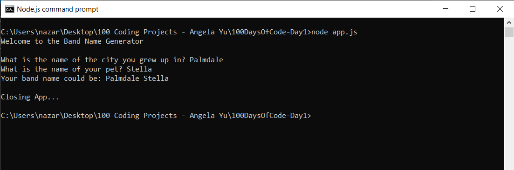

# 100 Days of Code - Day 1 - Band Name Generator

# Prompt

Write a program that has the following console features:

* Write "Welcome to the Band Name Generator"
* Ask the user for the name of the city they grew up in
* Ask the user for their pet's name
* Display their city + pet as their potential band name

# Example

Welcome to the Band Name Generator

What is the name of the city you grew up in?
Bristol

What is the name of your pet?
Tommy

Your band name could be: Bristol Tommy

# Screenshot of working solution

